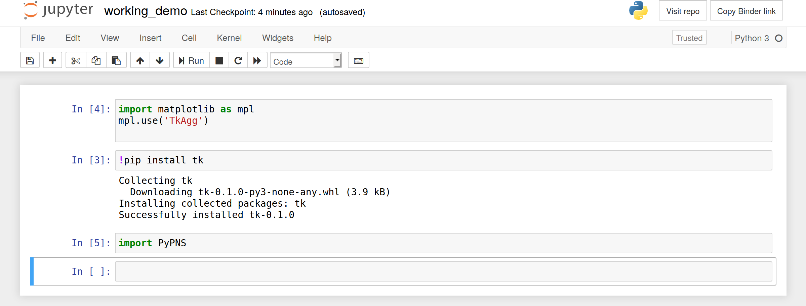

[](https://mybinder.org/v2/gh/fun-zoological-computing/PyPNS/master)
Enter code like in this picture 

# PyPNS

PyPNS is a Python module for the simulation of peripheral nerves. Axon models are simulated in the compartmental simulator [NEURON](http://www.neuron.yale.edu/neuron) over its [Python interface](http://www.frontiersin.org/neuroinformatics/10.3389/neuro.11.001.2009/abstract). Extracellular potentials from membrane currents or stimulation electrodes are calculated in a resistive, electro-quasistatic approximation of the Maxwell equations from either a homogeneous analytical solution, precomputed and imported finite element model outputs or analytical functions fit to FEM results.

PyPNS was developed in the Department of Bioengineering, Centre of Neurotechnology at Imperial College London.

This scientific software is released under the GNU Public License GPLv3.

# Requirements

To install PyPNS you will need:

- Python3
- Python modules numpy, scipy and matplotlib
- NEURON (from http://www.neuron.yale.edu) compiled as a Python module. IMPORTANT: Do not rely on `pip` for the installation of NEURON. Below is a guide on how to install NEURON including the Python interface from source. PyPNS is tested for NEURON 7.6.7 with InterViews 19

## NEURON installation

It is advisable to install NEURON from source. The following description is closely based on [Andrew Davidson's tutorial](http://andrewdavison.info/notes/installation-neuron-python/) and copied here to make sure it is available. Another good description can be found on the official page [here](https://www.neuron.yale.edu/neuron/download/compile_linux).

### Download the source from the NEURON site

Download the NEURON source `nrn-nn.tar.gz`
 and the corresponding version of InterViews `iv-mm.tar.gz` from [here](https://neuron.yale.edu/neuron/download/getstd).
 
 ### Compile and install InterView

Replace `mm` with your InterViews version number.

```
 N=`pwd`
 tar xzf iv-mm.tar.gz
 cd iv-mm
 ./configure --prefix=`pwd`
 make
 make install
````

### Compile and install NEURON

Replace `nn` with your NEURON version number and `mm` with your InterViews version number.

```
cd ..
tar xzf nrn-nn.tar.gz
cd nrn-nn
./configure --prefix=`pwd` --with-iv=$N/iv-mm --with-nrnpython
make
make install
```

If you want to run parallel NEURON, add --with-paranrn to the configure options. On Mac OS X, I have found I need to add PYLIB=-lpython PYLIBLINK=-lpython to the configure line.

### Add NEURON binaries to `PATH` variable

Replace `nn` with your NEURON version number and `x86_64` with your architecture code.

```
export PATH=$N/nrn-nn/x86_64/bin:$PATH
```

### Build NEURON for Python

```
cd src/nrnpython
python setup.py install
```

This command (which will probably have to be run as root or using sudo) will install the neuron package to your site-packages directory. An alternative, especially if you don't have root privileges, is:

```
python setup.py install --prefix=~
```

which will install the neuron package to ~/lib/python/site-packages. You will then have to add this directory to the PYTHONPATH environment variable:

```
export PYTHONPATH=$PYTHONPATH:~/lib/python/site-packages
```

# Installation

Using pip or easy install

	pip install PyPNS

	easy_install PyPNS

From source:

    tar -xzf PyPNS-x.x.tar.gz
    cd PyPNS-x.x
    python setup.py install


# Usage


To run PyPNS properly, several NEURON extensions need to be compiled for the myelinated axon model. Those are located in the `mods`-directory of PyPNS. Download this directory and run

	nrnivmodl

from the console. A new folder will be generated containing the compiled files. They need to be present in the working directory of your project.

If FEM results are to be used for either recording or stimulation, the 'Fields'-directory needs to be present within the working directory as well. Different field dictionaries need to be contained within subdirectories. Subdirectory name equals field name. One example field can be downloaded from GitHub.

# Testing

For a quick first test, download the `test.py` script from GitHub and run it:

```
python test.py
```

To reproduce figures of the paper go to this [figure-repository](https://github.com/cahelu/PyPNS-PaperFigures).

# Documentation

For further description of the different components of `PyPNS`, compile the Sphinx documentation. To do so, navigate to `documentation/source` within the PyPNS directory and run

	sphinx-build -b html . ../HTML
    


